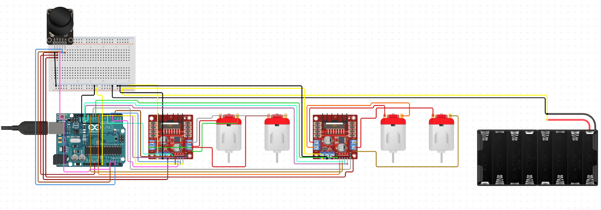

# Joystick Controlled Car (Wired)

An Arduino-based robot car project controlled using a **wired joystick** and **dual L298N motor drivers**, allowing full directional movement. This project helps you understand and build a robot car controlled through hardware components and joystick input.

---

## Table of Contents

- [About the Project](#about-the-project)
- [Components Used](#components-used)
- [Why Two L298N Motor Drivers?](#why-two-l298n-motor-drivers)
- [Using Only One L298N (Optional)](#using-only-one-l298n-optional)
- [Arduino IDE Setup](#arduino-ide-setup)
- [Code Overview](#code-overview)
  - [1. Test Code](#1-test-code)
  - [2. Final Code (Joystick Controlled)](#2-final-code-joystick-controlled)
- [Uploading the Code](#uploading-the-code)
- [Wiring Guide](#wiring-guide)
- [Make It Your Own](#make-it-your-own)
- [License](#license)

---

## About the Project

This project involves creating a simple yet powerful wired joystick-controlled robotic car using Arduino UNO and two L298N motor drivers. It includes both **testing code** to verify individual motor and joystick modules and a **final code** that integrates joystick inputs to control the movement of the car.

Whether you're a beginner or someone looking to participate in robotics competitions, this project serves as a strong foundation to build on.

---

## Components Used

- **Arduino UNO**
- **2x L298N Motor Driver Modules**
- **1x PS2 Joystick Module (Model: HW-504)**
- **4x DC Motors**
- **4x Wheels**
- **Battery Pack: 3.7V 18650 1200mAh (x2 or as needed for required voltage/current)**
- Jumper Wires
- Chassis Frame (custom)

---

## Why Two L298N Motor Drivers?

Each L298N module can control **two DC motors**. In this project, we are using **4 motors** (to power all four wheels). Therefore, we use **two motor drivers**—one for each pair of motors.

This dual driver setup provides:
- Independent control of all four motors
- Balanced power distribution and current handling
- Better performance and maneuverability for real-time joystick control

---

## Using Only One L298N (Optional)

If you want to build the project using only **one L298N motor driver**, you’ll need to:

- Use **only two DC motors** (either front or rear wheels).
- Adjust the code accordingly to remove references to the second motor driver.
- Sacrifice torque and traction as only two wheels will be powered.

This setup can still work for lightweight prototypes or when components are limited, but for optimal performance, especially in competitions, **dual L298N is recommended**.

---

## Arduino IDE Setup

To get started, install the **Arduino IDE**:

- Download from [official site](https://www.arduino.cc/en/software)
- Install any optional libraries if needed (joystick usually works without external libraries).

---

## Code Overview

The repository contains two `.ino` files:

### 1. **Test Code** (`test_code.ino`)

This code verifies that motors and joystick are connected and functioning.

- Test each motor one by one
- Read joystick’s analog and button values
- Observe outputs via **Serial Monitor**

### 2. **Final Code (Joystick Controlled)** (`joystick_car_final.ino`)

This code enables full movement based on joystick input:

- Forward, Backward, Left, Right movement
- Uses analog values from VRX/VRY to control direction
- Easy to modify or extend for future enhancements

---

## Uploading the Code

Steps to upload:

1. Connect your Arduino UNO via USB.
2. Open the desired `.ino` file in Arduino IDE.
3. Set board and port:
   - **Tools > Board > Arduino UNO**
   - **Tools > Port > [your port]**
4. Click the **Upload** button.
5. Once uploaded, disconnect USB and power your robot using the battery pack.

---

## Wiring Guide

Refer to the wiring diagram image above for full connections.

- Connect the joystick’s VRX and VRY to Arduino analog pins (e.g., A0, A1).
- Motor driver IN1–IN4 to Arduino digital pins.
- ENA/ENB should go to PWM pins (e.g., D5, D6, D9, D10).
- Motors connected to L298N outputs (OUT1–OUT4).
- Power Arduino via USB or 9V barrel jack.
- Power motor drivers with 3.7V 18650 battery pack.
- **Ensure all GNDs are connected**.

---

## Make It Your Own

You now have a complete wired joystick car with fully explained wiring, code, and components. The rest is up to your creativity!

- Design your **custom chassis** using cardboard, acrylic, or 3D printing.
- Modify the code to add features like acceleration, light control, or reverse gear.
- Compete in **robotic events** confidently.
- Extend this into a **wireless version** using Wi-Fi or Bluetooth (coming soon in a future repo).

All designs, wiring, and logic are shared openly. Build your dream bot!

---

## License

This project is open-source and free for educational and personal use. Credit is appreciated when reused or modified.

---
